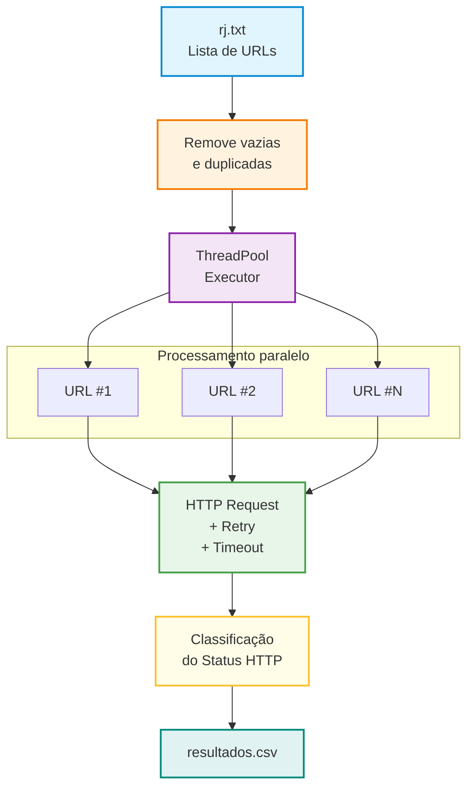

#  URL Checker v3

Ferramenta desenvolvida em **Python** para verificar múltiplas URLs de forma concorrente, identificando seus respectivos **status HTTP**, tempo de resposta e URL final após redirecionamentos.

O projeto utiliza múltiplas threads para acelerar o processamento, possui **retry automático**, tratamento de erros e gera um relatório completo em formato **CSV**.

---

## ✨ Funcionalidades

- Verificação concorrente de URLs.
- Utilização de `ThreadPoolExecutor`.
- Retry automático para determinados erros HTTP.
- Timeout configurável para conexão e resposta.
- Seguimento automático de redirecionamentos.
- Remoção de URLs duplicadas.
- Barra de progresso no terminal.
- Exibição da velocidade de processamento.
- Estimativa de tempo restante (ETA).
- Status coloridos no terminal.
- Exportação dos resultados para CSV.
- Identificação da URL final após redirects.
- Tratamento de erros de conexão e timeout.
- Resumo estatístico ao final da execução.

---

## Tecnologias utilizadas

O projeto utiliza as seguintes bibliotecas:

- **Python 3**
- `requests`
- `urllib3`
- `colorama`
- `concurrent.futures`
- `csv`
- `os`
- `time`

As bibliotecas `csv`, `os`, `time` e `concurrent.futures` fazem parte da biblioteca padrão do Python.

---

## Instalação

Clone o repositório:

```
git clone git@github.com:horadoqa/url-checker.git
```

 Entre no diretório:

```
cd url-checker
```

Instale as dependências:

```
pip install requests colorama
```

Caso prefira utilizar um arquivo `requirements.txt`, ele pode conter:

```
requests
colorama
```

E as dependências podem ser instaladas com:

```
pip install -r requirements.txt
```

---

## Estrutura do projeto

O programa utiliza a seguinte estrutura:

```
.
├── base/
│   └── 2024/
│       └── rj.txt
│
├── resultado/
│   └── resultados.csv
│
├── main.py
├── requirements.txt
└── README.md
```

O diretório `resultado` é criado automaticamente pelo programa caso não exista.

---

## Arquivo de entrada

As URLs devem ser informadas no arquivo:

```
base/2024/rj.txt
```

Cada URL deve estar em uma linha:

```
https://www.google.com
https://www.python.org
https://github.com
https://exemplo.com
```

Linhas vazias são ignoradas.

URLs duplicadas também são removidas automaticamente, mantendo a ordem da primeira ocorrência.

Por exemplo:

```
https://google.com
https://python.org
https://google.com
https://github.com
```

Será processado como:

```
https://google.com
https://python.org
https://github.com
```

---

## Executando o projeto

Execute o programa com:

```
python main.py
```

Ao iniciar, o programa apresenta as principais configurações:

```
======================================================================
URL CHECKER
======================================================================
URLs encontradas : 1000
Workers          : 20
Timeout          : (5, 15)
Retries          : 3
======================================================================
```

---

## Processamento concorrente

O programa utiliza:

```
ThreadPoolExecutor(max_workers=MAX_WORKERS)
```

Por padrão:

```
MAX_WORKERS = 20
```

Isso permite que até **20 URLs sejam processadas simultaneamente**, reduzindo consideravelmente o tempo necessário para verificar grandes listas de URLs.

A quantidade de workers pode ser alterada diretamente nas configurações:

```
MAX_WORKERS = 20
```

> A quantidade ideal de workers depende da conexão, dos servidores consultados e dos recursos disponíveis na máquina.

---

## Timeout

O timeout está configurado como:

```
TIMEOUT = (5, 15)
```

O primeiro valor representa o tempo máximo para estabelecer a conexão:

```
5 segundos
```

O segundo representa o tempo máximo aguardando a resposta:

```
15 segundos
```

A configuração pode ser alterada conforme a necessidade:

```
TIMEOUT = (10, 30)
```

---

## Retry automático

O programa possui mecanismo de tentativa automática utilizando `urllib3 Retry`.

Configuração atual:

```
RETRY_TOTAL = 3
```

São realizadas tentativas adicionais para determinados códigos HTTP:

```
RETRY_STATUS_CODES = [
    429,
    500,
    502,
    503,
    504
]
```

Isso significa que respostas como:

- `429` — Too Many Requests
- `500` — Internal Server Error
- `502` — Bad Gateway
- `503` — Service Unavailable
- `504` — Gateway Timeout

podem ser repetidas automaticamente.

Também existe um intervalo progressivo entre determinadas tentativas através de:

```
backoff_factor = 1
```

---

## Redirecionamentos

As requisições utilizam:

```
allow_redirects=True
```

Portanto, quando uma URL redireciona para outro endereço, o programa acompanha o redirecionamento.

Por exemplo:

```
http://exemplo.com
        ↓
https://exemplo.com
```

O resultado armazenará a URL inicial:

```
url
```

e a URL final:

```
final_url
```

---

## Classificação dos status

Os resultados são classificados nas seguintes categorias:

| Categoria | Descrição |
| --- | --- |
| `200` | Requisição bem-sucedida |
| `3xx` | Redirecionamento |
| `404` | Página não encontrada |
| `4xx` | Erro relacionado à requisição/cliente |
| `5xx` | Erro do servidor |
| `ERRO` | Falha de requisição, timeout ou outro erro |

### Cores no terminal

| Resultado | Cor |
| --- | --- |
| `200` | 🟢 Verde |
| `404` | 🔴 Vermelho |
| `3xx` | 🟡 Amarelo |
| Outros `4xx` | 🟡 Amarelo |
| `5xx` | 🔴 Vermelho |
| Erros | 🔴 Vermelho |

---

## Barra de progresso

Durante o processamento, o programa apresenta uma barra de progresso:

```
[====================--------------------]  50.0% 500/1000 | 25.4 URLs/s | ETA: 20s
```

São apresentadas as seguintes informações:

- Percentual concluído.
- Quantidade de URLs processadas.
- Total de URLs.
- Velocidade em URLs por segundo.
- Estimativa de tempo restante.

Exemplo:

```
[========================================] 100.0% 1000/1000 | 27.5 URLs/s | ETA: 0s
```

---

## Arquivo de saída

Ao finalizar o processamento, os resultados são armazenados em:

```
resultado/resultados.csv
```

O arquivo utiliza codificação:

```
UTF-8 com BOM
```

através de:

```
encoding="utf-8-sig"
```

Isso facilita a abertura do arquivo em programas como **Microsoft Excel**.

---

 ## Estrutura do CSV

O relatório possui cinco colunas:

```
url
status_code
final_url
tempo
erro
```

Exemplo:

```
url,status_code,final_url,tempo,erro
https://google.com,200,https://www.google.com/,0.245,
https://example.com,200,https://example.com/,0.312,
https://example.com/inexistente,404,https://example.com/inexistente,0.198,
```

### `url`

URL original encontrada no arquivo de entrada.

### `status_code`

Código HTTP retornado pelo servidor.

Exemplo:

```
200
301
404
500
```

### `final_url`

URL final após os redirecionamentos.

### `tempo`

Tempo necessário para realizar a requisição, em segundos.

Exemplo:

```
0.325
```

### `erro`

Mensagem de erro quando a requisição não consegue ser concluída.

Exemplo:

```
TIMEOUT: ...
```

---

## Resultado final

Ao terminar todas as requisições, o programa apresenta um resumo semelhante a:

```
======================================================================
RESULTADO
======================================================================
Total de URLs : 1000
Status 200    : 720
Status 3xx    : 100
Status 404    : 80
Status 4xx    : 50
Status 5xx    : 30
Erros         : 20
----------------------------------------------------------------------
Tempo total   : 38.42s
Velocidade    : 26.03 URLs/s
CSV salvo em  : resultado/resultados.csv
======================================================================
```

---

## Configurações

As principais configurações ficam no início do código:

```
ARQUIVO_ENTRADA = "base/2024/rj.txt"
ARQUIVO_SAIDA = "resultado/resultados.csv"

MAX_WORKERS = 20

TIMEOUT = (5, 15)

RETRY_TOTAL = 3

RETRY_STATUS_CODES = [
    429,
    500,
    502,
    503,
    504
]
```

### Arquivo de entrada

```
ARQUIVO_ENTRADA = "base/2024/rj.txt"
```

Define onde estão as URLs que serão verificadas.

### Arquivo de saída

```
ARQUIVO_SAIDA = "resultado/resultados.csv"
```

Define onde o relatório será salvo.

### Workers

```
MAX_WORKERS = 20
```

Define o número máximo de tarefas executadas simultaneamente.

### Timeout

```
TIMEOUT = (5, 15)
```

Define os limites de tempo da conexão e da resposta.

### Retries

```
RETRY_TOTAL = 3
```

Define a quantidade de tentativas adicionais utilizadas pelo mecanismo de retry.

---

## Fluxo de funcionamento

O funcionamento geral pode ser representado da seguinte forma:



---

## Observações

O programa realiza requisições HTTP para todas as URLs fornecidas no arquivo de entrada.

Dependendo da quantidade de URLs, da configuração de `MAX_WORKERS` e das políticas dos servidores consultados, podem ocorrer respostas como `429 Too Many Requests`.

Por esse motivo, recomenda-se utilizar uma quantidade responsável de workers e respeitar as políticas de acesso dos servidores.

O projeto não deve ser utilizado para sobrecarregar serviços ou realizar requisições de forma abusiva.

---

 ## Possíveis melhorias

Algumas melhorias que podem ser implementadas futuramente:

- Adicionar argumentos via linha de comando.
- Permitir escolher o arquivo de entrada dinamicamente.
- Permitir definir `MAX_WORKERS` via CLI.
- Adicionar suporte a `HEAD` antes de `GET`.
- Criar logs detalhados.
- Separar resultados por código HTTP.
- Gerar estatísticas adicionais.
- Adicionar testes automatizados.
- Implementar uma interface gráfica.
- Adicionar suporte a múltiplos arquivos de entrada.
- Permitir exportação para JSON.
- Utilizar uma configuração externa para os parâmetros.

---

## Licença

Este projeto não possui uma licença especificada.

Caso o projeto seja disponibilizado publicamente, recomenda-se adicionar uma licença, como MIT, Apache 2.0 ou outra que corresponda à forma desejada de distribuição.

---

## Autor

Projeto desenvolvido em **Python** para análise e verificação de status HTTP de listas de URLs.

---

**Python • Requests • ThreadPoolExecutor • Retry • CSV**